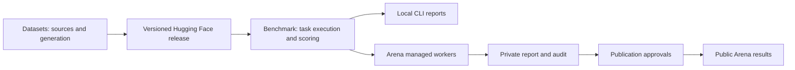

# Evaluation contract v2 — implementation target

Implemented Step 2: see [shared contracts v1](shared-contracts-v1.md) for the working schemas, classification runner and private Arena preview. The remaining sections record the broader destination.

This contract records the agreed destination. It does not claim that the endpoint runner or Arena integration is implemented. It supersedes repository ownership and publication policy in the v1 platform contract; historical scores retain their original protocol.

## Repository boundaries

| Owner | Responsibility |
|---|---|
| datasets | Collection, cleaning, normalization, synthesis, provenance and pinned releases |
| benchmark | Versioned task packs, endpoint runner, scoring saved responses, uncertainty and reports |
| Arena | Identity, quota reservation, endpoints, orchestration, evidence storage, approvals and public views |

Local and remote candidate models use OpenAI-compatible endpoints. Keep endpoint credentials out of reports and logs. Local CLI results are useful for development but cannot be uploaded as Arena-publishable results. Only website-managed runs may enter the Arena publication workflow. Arena workers must import a pinned benchmark distribution and record its artifact hash; they must not fork scoring logic.

## Required immutable records

| Record | Required fields |
|---|---|
| Task pack | ID/version, dataset revision and hashes, task IO schema, case/split manifest, metric/rubric version, baseline, stop rule |
| Run | ID, origin, organization, task pack digest, benchmark version/hash, model claimed ID, endpoint identity, prompt/settings, harness version, budgets, start/end times |
| Case attempt | Run and case IDs, attempt number, request configuration hash, response artifact hash, timing, usage source, status, error class |
| Result revision | Run ID, immutable revision/hash, expected/completed/failed unique case counts, metric numerator/denominator, scorer/judge settings, uncertainty, evidence references |
| Approval | Exact result hash, actor ID and role, organization or Najd scope, decision/time/reason |
| Publication | Result hash, independent or organization-submitted basis, required approvals, published_at, withdrawal/correction history |

Server-issued origin is authoritative. A client-provided `arena_managed` field never establishes eligibility. All requested cases remain accounted for, including failures and invalid outputs. Retries retain evidence but cannot inflate the unique-case denominator. Regrading creates a new result revision and invalidates old publication approvals for the new revision.

## Scorecards that explain the numbers

| Metric | Meaning | Required companion |
|---|---|---|
| Task success | Successful cases / all assigned eligible cases | Rubric, failures, invalid outputs and confidence interval |
| Classification | Accuracy and per-label precision/recall; macro F1 where appropriate | Label counts, confusion matrix, abstention handling |
| Support policy compliance | Cases satisfying policy rubric / assigned cases | Unsupported commitments and escalation failures |
| Grounding | Claims supported by provided evidence | Citation/claim annotation policy and missing evidence |
| Tool decisions | Correct call, clarification or abstention | Argument validity and unsafe-action rate |
| Latency | End-to-end elapsed time distribution | p50/p95, sample counts, concurrency, timeout and retry policy |
| Cost | Measured or estimated spend | Token accounting source, price date, missing-usage rate |

Report unavailable metrics as unavailable, not zero. Do not blend different prompts, thinking levels, harnesses or datasets. Model-only and Pi coding-agent results use separate views. A historical acceptable-output rate is not automatically accuracy or policy compliance.

Every report answers: what problem was tested, what improved, how much uncertainty remains, which failures matter, and what change to try next. Example: “Version B reduced unsupported refund promises from 8/100 to 3/100 on the same cases; investigate the five changed cases and paired uncertainty before concluding the prompt generalizes.” This is a fictional reporting example, not a Najd result.

## Delivery sequence and gates

| Milestone | Evidence | Dependency / stop rule |
|---|---|---|
| 1. Public-source audit and contract | All historical rows inventoried; current gaps visible | Do not call declared URLs a successful rebuild |
| 2. Support task pack and runner | Fake-server integration tests for successful, invalid, timeout and retry responses; deterministic saved-response scoring | Reviewed task contract and baseline first |
| 3. Worker extraction | Same frozen inputs produce identical CLI and managed-run scores | Pin package; remove duplicate Arena scoring only after parity |
| 4. Managed pilot | Two internal support versions run from platform with complete private evidence | Quotas, isolation and queue recovery tested |
| 5. Publication | Role, result-hash approval and withdrawal tests | No publication from CLI/imported origin |

For the first support pilot, freeze scenarios, policies and rubric before comparing versions. Use scenario-level splits and paired analysis. Stop if evaluation cases influenced prompt tuning or reference labels are unresolved.
