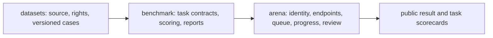

# Najd benchmarking platform contract

## Outcome and current state

Najd should let a verified organization submit an endpoint, watch an evaluation run, and inspect a reproducible result. A public reader should see what was measured and which evidence supports a ranking.

The datasets repository already pins the `najd-benchmark@2026.09.14` release: 5,717 certified cases and 372 quarantined cases. The certified split is public. The benchmark repository currently has no executable scoring package. The Arena repository contains a local evaluation runtime and work in progress on a web app and worker. Its scoring logic is not yet owned by this repository. No score should be described as independently certified until the gates below pass.

Published dataset: <https://huggingface.co/datasets/najdresearch/najd-benchmark/tree/cb30c1c9e46c62f691380c3269885cdb8f22f52b/datasets/najd-benchmark/2026.09.14>.

## Repository boundaries

| Owner | Owns | Does not own |
|---|---|---|
| `datasets` | Collection, cleaning, provenance, rights, schemas, frozen Hugging Face releases | Model inference and scores |
| `benchmark` | Task selection, prompt/output contracts, scoring, aggregation, baselines, uncertainty, report schema | User accounts, credentials, queues |
| `arena` | Sign-in, organization verification, roles, endpoint registration, encrypted run credentials, execution, progress, moderation, publication | Independent definitions of official metrics |

Arena must pin a benchmark package version and dataset revision for each run. It may display provisional progress, but only the benchmark package can produce an official score report. No worker or web handler should reimplement the aggregate.

## First public text score

The first score uses only the certified cases in the pinned public release. It is an **open, reproducible text score**, with a breakdown by task and source. Because inputs and labels are public, the score cannot establish that a model has not seen them during training. The leaderboard must state that limit beside the score.

| Rule | First-version decision |
|---|---|
| Included cases | Certified split only; quarantine excluded |
| Eligibility | Complete canonical run on the full frozen selection, with all required grades and a frozen judge profile |
| Headline | One `Najd Text` score plus task and source breakdowns; score formula and task weights versioned before runs count |
| Attempts | One scored response per case; retries only for transport failure and recorded separately |
| Missing, invalid, timed-out | Count in the denominator and score zero; show separate rates |
| Repeatability | Record model ID claimed and returned, endpoint class, prompt version, inference settings, judge version, dataset revision, benchmark version, case counts, latency, and cost |
| Publication | Human review of a complete evidence bundle; reviewer decision and reason retained |

Before freezing the headline formula, audit each existing task's grader against human-reviewed examples. In particular, exact-choice parsing, instruction-following checks, and judge-based grades need measured false-positive and false-negative rates. A formula that averages task means must specify the task list and weights; adding a task creates a new score version.

## Submission and identity

The organization supplies the target endpoint and API key, and pays that endpoint's inference bill. Najd pays for its workers and any independent judging. An admin manually approves each organization after checking its linked GitHub or Hugging Face presence. A linked account verifies a submitting organization, not the weights behind an arbitrary API endpoint. Public model identity should therefore distinguish `organization verified`, `model artifact verified`, and `endpoint claim only`.

| Role | Initial capability |
|---|---|
| Platform admin | Set policy and quotas, approve organizations, assign moderators, resolve appeals |
| Moderator | Review run evidence, publish or reject eligible results, record reasons |
| Organization admin | Manage membership, model registration, endpoint settings, and submissions |
| Organization member | Launch and inspect organization runs within assigned limits |
| User | View public results and methodology |

Secrets never enter run artifacts or public reports. The worker needs a short-lived way to use a credential; endpoint validation must block local or private network targets both at submission and at request time. Real-time progress can show stages, completed count, error count, and estimated remaining work to authorized organization members. Intermediate scores are provisional and should not appear on the public leaderboard.

## Evaluation lanes

| Lane | Cases | Claim |
|---|---|---|
| Open reproduction | Public, pinned Hugging Face release | Anyone can inspect and rerun the protocol; training exposure is possible |
| Controlled evaluation | Separately approved, access-controlled holdout | Tests generalization under a disclosed private-evaluation protocol |

These lanes never share a leaderboard or a score name. A future controlled lane requires rights review, independently checked labels, leakage controls, a disclosed governance policy, and a plan for refreshing cases. Do not use employer material or the 372 quarantined cases to populate it.

## Milestones and stop rules

| Milestone | Reviewable evidence | Proceed when | Stop or revise when |
|---|---|---|---|
| 1. Freeze one text task | Versioned task contract, fixed case IDs, baseline, scorer tests, human error audit | An independent runner reproduces the same scores from the same responses | Label ambiguity or grader error makes ranking unstable |
| 2. Freeze text score v1 | Frozen task list and weights, complete-case policy, uncertainty report, at least two baselines | Repeated runs give interpretable differences and every score is traceable to graded cases | Score is dominated by one source, judge drift, or invalid outputs |
| 3. Connect Arena | Arena worker imports benchmark package; one submitted endpoint run produces a matching local report | No duplicate scoring implementation; secret and endpoint boundary checks pass | Progress, credentials, or grader results leak across organizations |
| 4. Publish leaderboard | Manual review trail, public methodology and limitation, model identity status | Published rows can be independently checked from released artifacts | Organization identity or result provenance is unverifiable |
| 5. Jev decision suites | Separate classification and tool-decision scorecards with task-specific costs and abstention rules | Simple baselines and human review justify the new suite | The task measures answer formatting rather than decisions |

Embedding, reranking, OCR, STT, and TTS follow later as separate task families. Each needs a modality-specific input/output contract, baseline, metric, and rights-cleared data before Arena accepts submissions for it.

The design borrows task-specific metrics and transparent scenarios from [HELM](https://crfm.stanford.edu/helm/), separate modality evaluations and explicit score weights from [Artificial Analysis](https://artificialanalysis.ai/methodology/intelligence-benchmarking), and reviewed public comparisons from [LM Arena](https://forward-testing.lmarena.ai/faq). These are design references, not evidence that Najd's graders or rankings are valid.

## Immediate next artifact

Implement the first task contract and scorer here, then compare its output byte-for-byte with Arena's current scorer on a frozen set of responses. Move Arena to the package only after that comparison and the human error audit pass. The candidate first task should be a certified, objectively graded Saudi/Arabic text task from the existing release; task selection requires checking label quality and class balance, not just row count.
