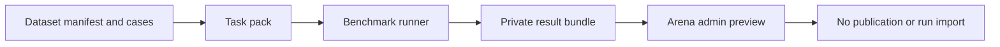

# Shared contracts v1

A dataset, an evaluation task, and a result must agree on exactly what was tested.
The benchmark package owns the JSON Schemas and Python validator. Other repositories
vendor byte-identical copies pinned by Git revision and SHA-256 in `contracts.lock.json`.



## Records

| Contract | Required meaning |
|---|---|
| Dataset manifest | Stable ID/version, source/revision, rights evidence, development/test split, exact case-file hash, ordered unique case IDs and count |
| Task pack | Pinned dataset identity, task type, prompt/output contract, labels, harness/scorer versions, budget, baseline, uncertainty and stop rules |
| Result bundle | Dataset and task records/digests; requested and returned models; implementation source hash; settings; private origin; every assigned case; outputs, hashes, timing, usage, grades and artifacts |
| Case | Stable ID, original prompt and reference label for the classification slice |

Schemas are at `src/najd_benchmark/schemas/`. Version 1 executes only the documented
single-turn JSON-label classification slice. Other modalities require a new case/output
contract and a supported scorer before execution. Unknown contracts fail rather than
silently falling back to a generic judge. Existing historical Arena records are not
migrated to v1 by relabeling them.

## Integrity and trust

JSON object digests use RFC 8785 canonical JSON, UTF-8 and SHA-256. Raw case-file hashes
cover the original bytes. Response hashes cover the exact UTF-8 response string. The
bundle hash excludes only its own `bundle_sha256` field. The implementation source hash
covers sorted relative `.py` and `.json` package files; it is not a wheel or environment hash.
Python validates schemas, references, hashes, IDs, parsed outputs and recomputed metrics.
The web preview checks schemas, hashes, labels and case accounting; it does not execute
the Python scorer or attest that a model produced an uploaded response.

Hashes detect content changes, not honesty. A caller can claim `arena_managed`; that
never establishes eligibility. Preview has no database write, queue or publication path.
Only independently recorded server execution and later version-bound approvals can
establish publication eligibility. Do not place credentials or private endpoints in bundles.
Model output may itself contain sensitive material: preview is admin-only and not stored.

## What the numbers mean

| Metric | Definition and limitations |
|---|---|
| Accuracy | Correct labels / all assigned cases; invalid outputs and provider errors contribute zero |
| Grading coverage | Provider responses, including invalid outputs, / assigned cases; provider errors remain visible |
| Macro F1 | Equal mean of per-label F1 across declared labels; zero when a label has no positive prediction/support |
| Per-label precision/recall | Correct predictions / predictions and correct predictions / reference support |
| Confusion matrix | Reference vs predicted label; null predictions include invalid output and provider errors |
| 95% interval | Wilson binomial interval for accuracy; illustrative for eight fixed synthetic cases, not proof of generalization |
| Latency | End-to-end request time including provider failures; p50/p95 use nearest-rank; one attempt, sequential requests |
| Usage | Sum of provider-reported token counts plus count of missing usage records; missing values are not measured zeros |
| Cost | Unavailable (`null`); no invented price estimate |

An always-billing baseline gets 2/8 on the original development fixture. These eight
obvious routing examples verify plumbing, not support quality or Saudi AI superiority.
A useful report points to specific failed routes, invalid formats and transport failures
before suggesting prompt or endpoint changes. It must not claim quality gains from this
fixture alone. There is no sealed test set in this milestone.

## Run the working slice

```sh
uv sync --extra dev
uv run najd-contract validate-pack examples/arabic-support-routing-v1
uv run najd-contract run --pack examples/arabic-support-routing-v1 \
  --endpoint http://localhost:8000/v1 --endpoint-kind local --model local-model \
  --output /tmp/support-result.json
uv run najd-contract validate-bundle /tmp/support-result.json
```

For a remote endpoint, use `--endpoint-kind remote` and `--api-key-env YOUR_KEY_ENV`.
Keys are read from the environment, never serialized. The small runner supports one
attempt and one request at a time; transport errors are recorded by class without their
potentially sensitive message. Existing output files are never overwritten. To reproduce
metrics, retain the pinned cases, task pack and bundle together.

In Arena, a Najd admin opens `/admin/contract-preview` and selects the JSON file. The
preview remains private and explicitly non-publishable, even if its origin claims otherwise.

## Contribution and version policy

1. Propose a task and its user problem, original or licensed data, split, label rubric and baseline.
2. In datasets, add a deterministic builder plus manifest and rights/change evidence.
3. In benchmark, add the task/scorer contract and positive, negative, malformed-output,
   provider-error, tampering and coverage tests. Never tune on sealed evaluation cases.
4. Update the canonical schemas only here. Breaking changes require a new contract major
   version. Existing accepted versions stay readable; unknown versions are rejected.
5. Pin the exact schema commit and file hashes in consumers, then run their contribution checks.
6. Changing case contents increments the dataset version; prompt/harness/scorer changes
   increment the task version. Regrading produces a new result hash and requires new approvals.

Step 2 delivers contracts, validation and this small runner/preview slice. Extracting all
legacy Arena execution/scoring, managed support comparisons, quotas and publication
attestation remain later milestones.
